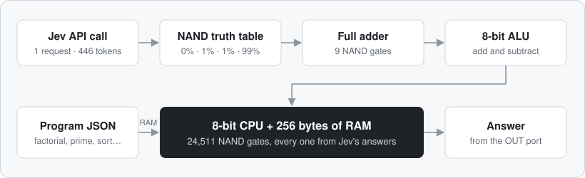
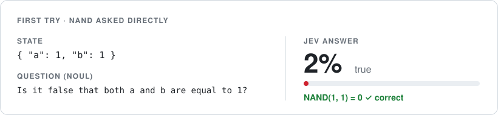
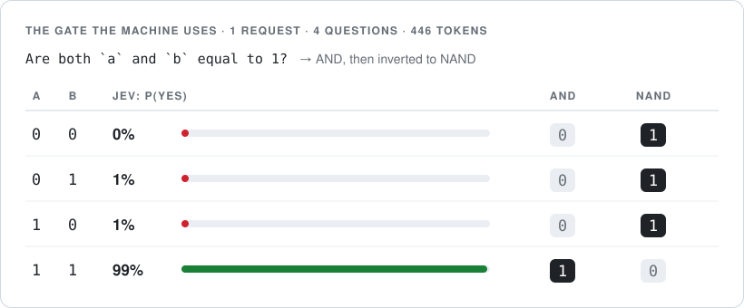
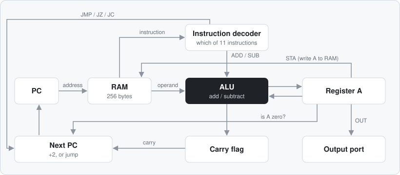
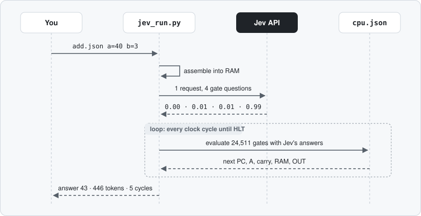

# jev-computer

**An 8-bit computer built from one yes/no question asked to an AI.**

[ภาษาไทย → README.th.md](README.th.md)

[Jev](https://docs.typesafe.ai) (TypeSafe's System One model) doesn't do arithmetic, doesn't know what a CPU is, and writes no code. It is asked a single thing through its API:

> *"Are both `a` and `b` equal to 1?"*

Its answers to the four possible inputs become an AND gate, which is inverted to NAND. NAND is a universal gate, so 24,511 of them wired together make a working computer with 256 bytes of RAM. It runs factorial, prime testing and bubble sort. Programs are plain JSON files.



## The idea: start from 0 and 1

It didn't start as a computer. It started as a question: **can Jev add numbers?**

1. **Asking directly wobbles.** One digit of `7 + 8` came back right with 98% confidence, but the carry ("does this column carry 1?") came back at only 88%, for a sum as easy as 15. One wrong carry spreads into every column after it. Questions that need several steps of thinking are where Jev gets unsure.
2. **So shrink the question until it can't be ambiguous.** The smallest question in computing is about two bits: *"Are both `a` and `b` equal to 1?"* There are only four possible inputs, so all four can be tested. Jev answers 0.99 for (1, 1) and 0.00–0.01 for the other three, every time.
3. **That answer is a logic gate.** "Both are 1" is AND. Flip it and you get NAND, and NAND is *universal*: every digital circuit, including a whole computer, can be built from NAND alone.
4. **Then build back up, one layer at a time.** Each layer uses only the one below it:

| Layer | Built from | Size |
|---|---|---|
| One question to Jev | 4 yes/no answers | 1 API request, 446 tokens |
| NAND gate | Jev's answers | 1 gate |
| Full adder (adds 3 bits) | NAND gates | 9 gates |
| 8-bit adder | full adders | 72 gates |
| CPU: decoder, ALU, flags, program counter | adders and gates | 383 gates |
| Whole machine: CPU + 256 bytes of RAM | all of the above | 24,511 gates |
| Programs: factorial, prime, bubble sort | instructions in RAM | JSON files |

The lesson carries over to real Jev apps: **don't ask a model one big question it has to reason through. Break it into the smallest judgments it can answer sharply, and let code combine them.**

### What Jev actually answered

**The first try:** asking for NAND directly with a = 1, b = 1. Jev said 2% "true", which is correct (NAND of 1 and 1 is 0).



**What the machine uses now:** the AND question for all four cases in one request, then inverted to NAND. Jev answers 0%, 1%, 1% and 99%. The machine switched to the AND wording because negated questions ("Is it false that…") make Noul less sharp, and because one request covering all four cases is cheaper and can be tested completely.



### Is it really built from Jev?

Yes, in the same way a real computer is built from transistors. Transistors decide what each gate outputs, but they still need a circuit board, wires and a clock. Here, **Jev decides what every gate outputs**. `cpu.json` is the circuit board, and `jev_run.py` is the wires and the clock. A computer built from redstone in Minecraft works the same way: it runs on a game engine written in Java, yet everyone calls it a redstone computer.

To be precise about it: Jev answers the 4 gate cases **once per run**, and those answers drive all 24,511 gates on every clock cycle. Jev defines the gate; it doesn't flip each switch itself. There's no backup either: if Jev answered even one case wrong, every program would compute wrong. Python never does the arithmetic.

## Quick start

Python 3.9+, standard library only.

```bash
cp .env.example .env                                  # add your TypeSafe API key

python jev_run.py --selftest                          # check Jev's gate answers (5 requests)
python jev_run.py programs/factorial.json n=5         # 120
python jev_run.py programs/prime.json n=97            # 1 (prime)
python jev_run.py programs/bubble_sort.json list=5,2,9,1,7,3
```

```
$ python jev_run.py programs/mul.json a=7 b=6
a x b by repeated addition (b is the loop count). Answers overflow above 255.
output port: [42]
answer: 42
jev: 1 request · 446 input tokens ($0.000019) · 0.9 s · 59 clock cycles · 1,446,149 gate evaluations
```

| Option | What it does |
|---|---|
| `name=value` | Set one of the program's inputs (0–255) |
| `name=4,7,9` | Set a list input |
| `--trace` | Print every instruction the CPU runs |
| `--test` | Run the tests written inside the program's JSON |
| `--selftest` | Ask Jev the gate question 5 times and check every answer |

## Programs

| File | Does | Inputs | Example |
|---|---|---|---|
| `add.json` | a + b (up to 510) | `a`, `b` | `a=255 b=255` → 510 |
| `sub.json` | a − b (can be negative) | `a`, `b` | `a=15 b=17` → −2 |
| `mul.json` | a × b | `a`, `b` | `a=7 b=6` → 42 |
| `div.json` | a ÷ b (whole number) | `a`, `b` | `a=200 b=7` → 28 |
| `power.json` | x to the power y (loop in a loop) | `x`, `y` | `x=3 y=5` → 243 |
| `pow2.json` | 2 to the power y | `y` | `y=7` → 128 |
| `factorial.json` | n! (loop in a loop) | `n` | `n=5` → 120 |
| `sum_to_n.json` | 1 + 2 + … + n | `n` | `n=10` → 55 |
| `gcd.json` | Greatest common divisor (Euclid) | `a`, `b` (1–255) | `a=48 b=18` → 6 |
| `prime.json` | Is n prime? (1 = yes, 0 = no) | `n` | `n=251` → 1 |
| `max_min.json` | Largest and smallest of 8 numbers | `list` (8) | `list=42,7,19,200,3,88,150,64` → [200, 3] |
| `linear_search.json` | Position of `x` in 8 numbers | `list` (8), `x` | `x=42` → 5 |
| `bubble_sort.json` | Sort 6 numbers | `list` (6) | `list=5,2,9,1,7,3` → [1, 2, 3, 5, 7, 9] |
| `countdown.json` | n, n−1, … 0 | `n` | `n=5` → 5 4 3 2 1 0 |
| `fib.json` | Fibonacci up to 144 | — | 0 1 1 2 … 144 |

All files are in `programs/`. Every program's tests pass on real Jev: 65 of 65, using 65 requests and 28,990 input tokens.

`max_min`, `linear_search` and `bubble_sort` walk their lists by rewriting their own `LDA`/`STA` instructions (self-modifying code), because the CPU has no pointer instructions.

### Using the programs well

- **Numbers are 8-bit (0–255).** Sums go to 510, because the carry comes out as a 9th bit. Differences can be negative. Results over 255 from `mul`, `power`, `pow2`, `factorial` and `sum_to_n` answer `overflow (> 255)`. Division gives the whole-number quotient.
- **Never divide by 0.** The CPU would loop forever, so the runner stops after 100,000 clock cycles with an error. `gcd` needs both numbers to be 1 or more for the same reason.
- **Put the smaller number in `b` for `mul`.** `b` is the loop count: `a=200 b=1` takes 14 clock cycles, `a=1 b=200` takes 1,805. Division takes about 8 cycles for each 1 in the answer (`255 ÷ 1` takes 2,046).
- **Every run costs the same.** It's 1 request and 446 tokens (about $0.00002), however long the program runs, because Jev answers the gate once and every gate reuses it. The longest test, `prime n=251`, runs 6,263 clock cycles (153 million gate evaluations) in about 5 seconds.
- **Use `--trace` to see how the answer was made.** It prints every instruction the CPU runs and the value of A at each step.

## Write your own program

A program is one JSON file. Nothing else needs to change.

```json
{
  "about": "Double a number: a + a.",
  "inputs": ["a"],
  "code": ["LDA a", "ADD a", "OUT", "HLT"],
  "data": {"a": 21},
  "tests": [
    {"with": {"a": 21}, "expect": [42]},
    {"with": {"a": 100}, "expect": [200]}
  ]
}
```

```bash
python jev_run.py double.json a=21     # answer: [42]
python jev_run.py double.json --test   # 2/2 passed
```

| Key | Meaning |
|---|---|
| `code` | Instructions, in order. Start a line with `name:` to label it, for example `"loop: LDA n"`. |
| `data` | Named variables, `{"n": 5}`, or lists, `{"list": [4, 7, 9]}`. They are placed in RAM right after the code. |
| `inputs` | Which `data` names can be set from the command line or by tests |
| `about` | One line printed before running |
| `result` | *Optional.* How to read the output port (see below) |
| `tests` | *Optional.* `{"with": {inputs}, "expect": answer}` cases, used by `--test` |

An operand can be a number (`LDI 5`), a label or data name (`JMP loop`, `LDA n`), or a name plus or minus a number (`LDA list+2`, `STA get+1`). With `LDI`, a name gives its address, so `LDI list` puts the list's address into A.

`result` options:
- Leave it out to get the list of every `OUT`.
- `{}` means the first `OUT` is the answer.
- `"add": n` adds n to the answer.
- `"second_output_adds": 256` adds 256 if there is a second `OUT` (a carry flag).
- `"no_output": "text"` is the answer when nothing was output.

Rules: code and data share 256 bytes of RAM (each instruction takes 2). Values are 0–255. The program must reach `HLT`.

### Instruction set

8-bit accumulator machine with 256 bytes of RAM. Every instruction is 2 bytes, `[opcode] [operand]`, and the PC moves forward by 2.

| Instruction | Meaning |
|---|---|
| `LDA n` | A = RAM[n] |
| `ADD n` | A = A + RAM[n], carry = 1 if it went over 255 |
| `SUB n` | A = A − RAM[n], carry = 1 if **no** borrow |
| `STA n` | RAM[n] = A |
| `LDI n` | A = n (0–255) |
| `JMP n` | jump to address n |
| `JZ n` | jump if A = 0 |
| `JC n` | jump if carry = 1 |
| `OUT` | send A to the output port |
| `HLT` | stop |
| `NOP` | do nothing |

## Results (real runs against `jev-1.13.0`)

| Run | Result | Requests | Input tokens | Time |
|---|---|---:|---:|---:|
| Gate selftest, 5 repeats × 4 cases | 20/20 correct, p = 0.00–0.01 / 0.99 | 5 | 2,230 | — |
| All program tests (15 programs) | 65/65 passed | 65 | 28,990 | ~63 s |

## How it works

1. **The gate.** One request carries four Noul questions, one per input case. Jev returns P(yes). `p ≥ 0.5` is AND = 1, and inverting that gives NAND.
2. **The circuit.** `build_cpu.py` builds the whole machine out of NAND only: instruction decoder, 8-bit ALU, carry and zero flags, program counter, jumps, and 256 bytes of RAM with three read ports (instruction, operand, data) and a write port. It writes the netlist, plus the instruction set, to `cpu.json`.
3. **The runner.** `jev_run.py` assembles a program JSON into RAM and asks Jev the 4 gate cases in one request. It then evaluates all 24,511 gates on every clock tick using Jev's answers, and latches the next state.

### Inside the CPU

Every box below is built only from NAND gates, and every NAND gate takes its output from Jev's answers.



### One run, step by step



| Jev: all the logic | Code: no logic |
|---|---|
| Decides what a gate outputs (the NAND truth table) | Holds register and RAM bits (flip-flops) |
| Every add, subtract, carry, decode, jump and RAM access comes from those answers through 24,511 gates | Ticks the clock and routes bits along the wires in `cpu.json` |
| If Jev answered wrong, the machine would compute wrong. There is no fallback. | Converts bits to decimal and reads the `result` rule |

## Files

| File | What it is | When you need it |
|---|---|---|
| `jev_run.py` | The runner: assembles a program JSON, asks Jev once, runs the clock | Every time you run something |
| `programs/*.json` | The 15 programs | Add a file here to add a program |
| `cpu.json` | The machine: 24,511 NAND gates and the instruction set (generated) | Read by `jev_run.py` |
| `build_cpu.py` | Builds `cpu.json` from NAND gates; `--check` verifies it without the API | Only if you change the machine's design |

## What this is (and isn't)

This is not a practical computer. It runs about ten billion times slower than a real CPU, and nobody should do arithmetic through a language model. What it shows:

- **Narrow, single-step judgments are extremely reliable.** The gate question gets 0.99 / 0.01 every time.
- **Packing questions that share one state into a single request cuts cost by about 66%.** That's 446 tokens instead of 1,304 for 4 separate requests.
- **Code owns state and control flow, and the model supplies judgments.** That split is the right architecture for real Jev applications too.

## License

MIT
