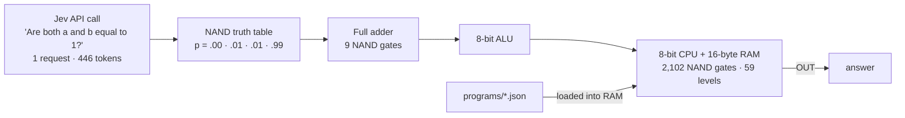
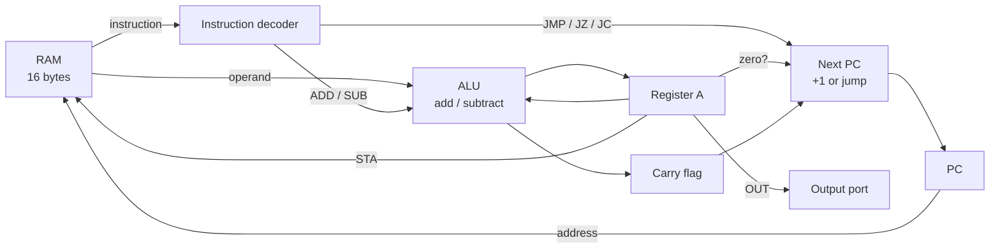
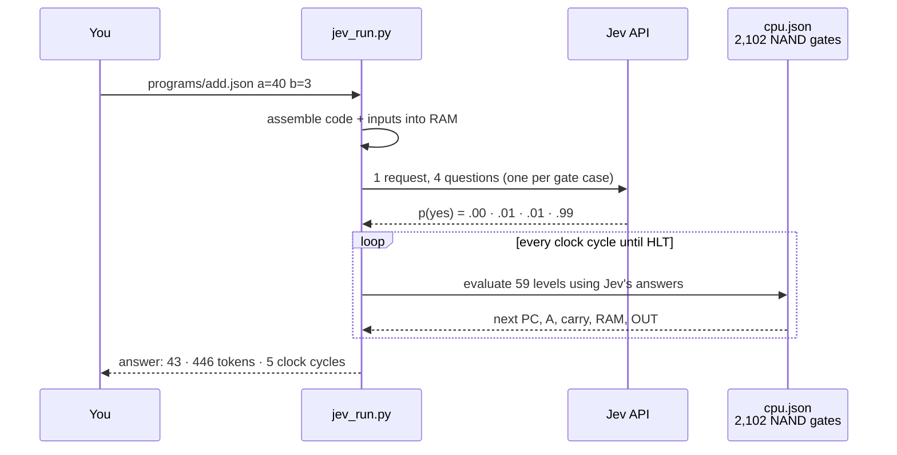

# jev-computer

**An 8-bit computer built from one yes/no question asked to an AI.**

[ภาษาไทย → README.th.md](README.th.md)

[Jev](https://docs.typesafe.ai) (TypeSafe's System One model) doesn't do arithmetic, doesn't know what a CPU is, and writes no code. It is asked a single thing through its API:

> *"Are both `a` and `b` equal to 1?"*

Its answers to the four possible inputs become an AND gate, which is inverted to NAND. NAND is a universal gate, so 2,102 of them wired together make a working computer. Programs are plain JSON files.



## Quick start

Python 3.9+, standard library only.

```bash
cp .env.example .env                          # add your TypeSafe API key

python jev_run.py --selftest                  # check Jev's gate answers (5 requests)
python jev_run.py programs/fib.json           # Fibonacci
python jev_run.py programs/add.json a=40 b=3  # 40 + 3
python jev_run.py programs/div.json a=200 b=7 # 200 ÷ 7
```

```
$ python jev_run.py programs/mul.json a=7 b=6
a x b by repeated addition (b is the loop count). No output means the product is over 255.
output port: [42]
answer: 42
jev: 1 request · 446 input tokens ($0.000019) · 0.9 s · 59 clock cycles · 124,018 gate evaluations
```

| Option | What it does |
|---|---|
| `name=value` | Set one of the program's inputs (0–255) |
| `--trace` | Print every instruction the CPU runs |
| `--test` | Run the tests written inside the program's JSON |
| `--selftest` | Ask Jev the gate question 5 times and check every answer |

## Programs

| File | Does | Inputs | Example |
|---|---|---|---|
| `programs/add.json` | a + b (up to 510) | `a`, `b` | `a=255 b=255` → 510 |
| `programs/sub.json` | a − b (can be negative) | `a`, `b` | `a=15 b=17` → −2 |
| `programs/mul.json` | a × b (up to 255) | `a`, `b` | `a=7 b=6` → 42 |
| `programs/div.json` | a ÷ b (whole number) | `a`, `b` | `a=200 b=7` → 28 |
| `programs/countdown.json` | n, n−1, … 0 | `n` | `n=5` → 5 4 3 2 1 0 |
| `programs/fib.json` | Fibonacci up to 144 | — | 0 1 1 2 … 144 |

Every program's tests pass on real Jev: 19 of 19, using 19 requests and 8,474 input tokens.

### Using the arithmetic programs well

- **Numbers are 8-bit (0–255).** Sums go to 510, because the carry comes out as a 9th bit. Differences can be negative. A product over 255 answers `overflow (> 255)`. Division gives the whole-number quotient.
- **Never divide by 0.** The CPU would loop forever, so the runner stops after 4,000 clock cycles with an error.
- **Put the smaller number in `b` for `mul`.** `b` is the loop count, so `a=200 b=1` takes 14 cycles while `a=1 b=200` takes about 1,800. Division takes about 8 cycles for each 1 in the quotient.
- **Every run costs the same.** It's 1 request and 446 tokens (about $0.00002), however many clock cycles the program takes, because Jev answers the gate once and every gate reuses it.
- **Use `--trace` to see how the answer was made.** It prints every instruction the CPU runs and the value of A at each step.

## Write your own program

A program is one JSON file. Nothing else needs to change.

```json
{
  "about": "Double a number: a + a.",
  "inputs": {"a": 15},
  "code": ["LDA 15", "ADD 15", "OUT", "HLT"],
  "data": {"15": 21},
  "tests": [
    {"with": {"a": 21}, "expect": [42]},
    {"with": {"a": 100}, "expect": [200]}
  ]
}
```

```bash
python jev_run.py double.json a=21     # answer: [42]
python jev_run.py double.json --test   # 2/2 passed
```

| Key | Meaning |
|---|---|
| `code` | Instructions, one per RAM address starting at 0 (see the instruction set below) |
| `data` | Starting values for RAM addresses after the code, `{"address": value}` |
| `inputs` | Names you can set from the command line, `{"name": address}` |
| `about` | One line printed before running |
| `result` | *Optional.* How to read the output port. Leave it out to get the list of every `OUT`. `{}` means the first `OUT` is the answer. `"second_output_adds": 256` adds 256 if there is a second `OUT` (a carry flag). `"no_output": "text"` is the answer when nothing was output. |
| `tests` | *Optional.* `{"with": {inputs}, "expect": answer}` cases, used by `--test` |

Rules: code and data share 16 bytes of RAM, and data can't overlap the code. Values are 0–255. The program must end with `HLT`.

### Instruction set

8-bit accumulator machine with 16 bytes of RAM. Each byte is `[opcode:4][address:4]`.

| Instruction | Meaning |
|---|---|
| `LDA n` | A = RAM[n] |
| `ADD n` | A = A + RAM[n], carry = 1 if it went over 255 |
| `SUB n` | A = A − RAM[n], carry = 1 if **no** borrow |
| `STA n` | RAM[n] = A |
| `LDI n` | A = n (0–15) |
| `JMP n` | jump to address n |
| `JZ n` | jump if A = 0 |
| `JC n` | jump if carry = 1 |
| `OUT` | send A to the output port |
| `HLT` | stop |
| `NOP` | do nothing |

## Results (real runs against `jev-1.13.0`)

| Run | Result | Requests | Input tokens | Time |
|---|---|---:|---:|---:|
| Gate selftest, 5 repeats × 4 cases | 20/20 correct, p = 0.00–0.01 / 0.99 | 5 | 2,230 | — |
| All program tests | 19/19 passed | 19 | 8,474 | ~15 s |

## How it works

1. **The gate.** One request carries four Noul questions, one per input case. Jev returns P(yes). `p ≥ 0.5` is AND = 1, and inverting that gives NAND.
2. **The circuit.** `build_cpu.py` builds the whole machine out of NAND only: instruction decoder, 8-bit ALU, carry and zero flags, program counter, jumps, 16-byte RAM read/write. It writes the netlist, plus the instruction set, to `cpu.json`.
3. **The runner.** `jev_run.py` loads a program JSON into RAM and asks Jev the 4 gate cases in one request. It then evaluates the netlist level by level using Jev's answers, and latches the next state on each clock tick.

### Inside the CPU

Every box below is built only from NAND gates, and every NAND gate takes its output from Jev's answers.



### One run, step by step



| Jev: all the logic | Code: no logic |
|---|---|
| Decides what a gate outputs (the NAND truth table) | Holds register and RAM bits (flip-flops) |
| Every add, subtract, carry, decode, jump and RAM access comes from those answers through 2,102 gates | Ticks the clock and routes bits along the wires in `cpu.json` |
| If Jev answered wrong, the machine would compute wrong. There is no fallback. | Converts bits to decimal and reads the `result` rule |

## Files

| File | What it is |
|---|---|
| `jev_run.py` | The runner: loads a program JSON, asks Jev, runs the clock |
| `programs/*.json` | Programs: add, sub, mul, div, countdown, fib |
| `cpu.json` | The machine: 2,102 NAND gates + instruction set (generated) |
| `build_cpu.py` | Builds `cpu.json` from NAND gates; `--check` verifies it (no API) |

## What this is (and isn't)

This is not a practical computer. It runs about ten billion times slower than a real CPU, and nobody should do arithmetic through a language model. What it shows:

- **Narrow, single-step judgments are extremely reliable.** The gate question gets 0.99 / 0.01 every time.
- **Packing questions that share one state into a single request cuts cost by about 66%.** That's 446 tokens instead of 1,304 for 4 separate requests.
- **Code owns state and control flow, and the model supplies judgments.** That split is the right architecture for real Jev applications too.

## License

MIT
