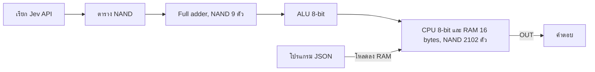
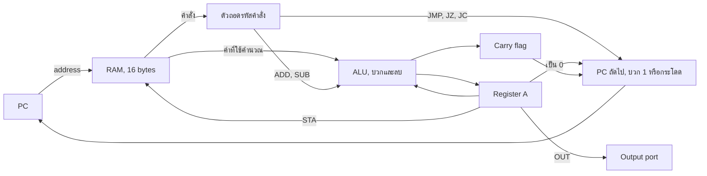
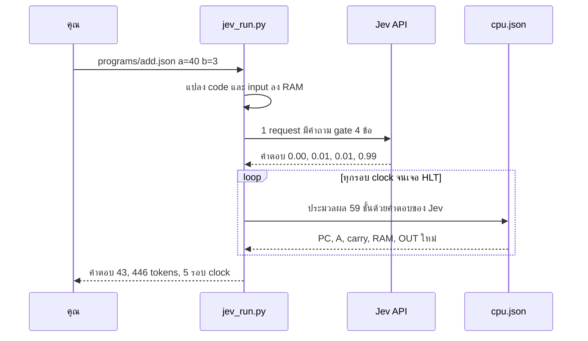

# jev-computer

**คอมพิวเตอร์ 8-bit ที่สร้างจากคำถาม ใช่/ไม่ใช่ ข้อเดียวที่ถาม AI**

[English → README.md](README.md)

[Jev](https://docs.typesafe.ai) (System One model ของ TypeSafe) คิดเลขไม่เป็น ไม่รู้จัก CPU และไม่ได้เขียนโค้ด มันถูกถามผ่าน API แค่เรื่องเดียว:

> *"`a` กับ `b` เป็น 1 ทั้งคู่ไหม?"*

คำตอบของ Jev ต่อ input ทั้ง 4 แบบกลายเป็น AND gate แล้วกลับค่าเป็น NAND ซึ่งเป็น universal gate คือสร้างวงจรดิจิทัลอะไรก็ได้จาก NAND อย่างเดียว เอา NAND 2,102 ตัวมาต่อกันก็ได้คอมพิวเตอร์ที่ใช้งานได้จริง ส่วนโปรแกรมเป็นแค่ไฟล์ JSON



## เริ่มใช้งาน

ใช้ Python 3.9 ขึ้นไป ไม่ต้องติดตั้ง library เพิ่ม

```bash
cp .env.example .env                          # ใส่ TypeSafe API key

python jev_run.py --selftest                  # ตรวจคำตอบ gate ของ Jev (5 requests)
python jev_run.py programs/fib.json           # Fibonacci
python jev_run.py programs/add.json a=40 b=3  # 40 + 3
python jev_run.py programs/div.json a=200 b=7 # 200 ÷ 7
```

```
$ python jev_run.py programs/mul.json a=7 b=6
a x b by repeated addition (b is the loop count). No output means the product is over 255.
output port: [42]
answer: 42
jev: 1 request · 446 input tokens ($0.000019) · 0.9 s · 59 clock cycles · 124,018 gate evaluations
```

| ตัวเลือก | ทำอะไร |
|---|---|
| `ชื่อ=ค่า` | ใส่ค่า input ของโปรแกรม (0–255) |
| `--trace` | แสดงทุกคำสั่งที่ CPU รัน |
| `--test` | รันชุดทดสอบที่เขียนไว้ในไฟล์ JSON ของโปรแกรม |
| `--selftest` | ถามคำถาม gate กับ Jev 5 รอบ แล้วตรวจทุกคำตอบ |

## โปรแกรม

| ไฟล์ | ทำอะไร | Input | ตัวอย่าง |
|---|---|---|---|
| `programs/add.json` | a + b (ได้ถึง 510) | `a`, `b` | `a=255 b=255` → 510 |
| `programs/sub.json` | a − b (ติดลบได้) | `a`, `b` | `a=15 b=17` → −2 |
| `programs/mul.json` | a × b (ได้ถึง 255) | `a`, `b` | `a=7 b=6` → 42 |
| `programs/div.json` | a ÷ b (ผลหารจำนวนเต็ม) | `a`, `b` | `a=200 b=7` → 28 |
| `programs/countdown.json` | นับ n, n−1, … 0 | `n` | `n=5` → 5 4 3 2 1 0 |
| `programs/fib.json` | Fibonacci ถึง 144 | — | 0 1 1 2 … 144 |
| `programs/gcd.json` | ห.ร.ม. (Euclid) | `a`, `b` (1–255) | `a=48 b=18` → 6 |
| `programs/max3.json` | ค่าที่มากที่สุดของ 3 ตัว | `a`, `b`, `c` | `a=7 b=42 c=19` → 42 |
| `programs/linear_search.json` | ตำแหน่งของ `x` ใน list 3 ตัว (3 = ไม่เจอ) | `a0`, `a1`, `a2`, `x` | `a0=4 a1=7 a2=9 x=7` → 1 |
| `programs/pow2.json` | 2 ยกกำลัง y (ได้ถึง 128) | `y` | `y=5` → 32 |
| `programs/sum_to_n.json` | 1 + 2 + … + n (ได้ถึง 253) | `n` | `n=10` → 55 |

ทุกโปรแกรมผ่านชุดทดสอบกับ Jev จริง 42 จาก 42 เคส ใช้ 42 requests และ 18,732 input tokens

`linear_search` ไล่อ่าน list ด้วยการแก้คำสั่ง `LDA` ของตัวเองทุกรอบ loop (self-modifying code) เพราะ CPU ไม่มีคำสั่ง pointer

### สิ่งที่ยังใส่ไม่ได้

code กับ data ใช้ RAM **16 bytes** ร่วมกัน โปรแกรมที่ต้องมี loop ซ้อน loop จะไม่พอ เพราะแค่การคูณแบบ loop ซ้อนก็ใช้ราว 12 bytes แล้ว จึงยังทำ `factorial`, `prime` (หารทดลอง), `x^y` แบบทั่วไป และ `bubble_sort` ไม่ได้ ถ้าจะทำต้องขยายเครื่อง เช่นใช้ address 8-bit กับ RAM 256 bytes ซึ่งต้องเปลี่ยนรูปแบบคำสั่งและสร้าง `cpu.json` ใหม่

### ใช้โปรแกรมคำนวณให้ได้ผลดี

- **ตัวเลขเป็น 8-bit (0–255)**
  - ผลบวกได้ถึง 510 เพราะ carry ออกมาเป็น bit ที่ 9
  - ผลลบติดลบได้
  - ผลคูณเกิน 255 จะตอบ `overflow (> 255)`
  - ผลหารได้เฉพาะจำนวนเต็ม
- **ห้ามหารด้วย 0** เพราะ CPU จะวนไม่จบ ตัวรันจะหยุดเองที่ 4,000 รอบ clock แล้วแจ้ง error
- **ใส่ตัวเลขที่เล็กกว่าเป็น `b` ใน `mul`** เพราะ `b` คือจำนวนรอบของ loop เช่น `a=200 b=1` ใช้ 14 รอบ clock แต่ `a=1 b=200` ใช้ราว 1,800 รอบ ส่วนการหารใช้ราว 8 รอบต่อผลหาร 1 หน่วย
- **ทุกการรันจ่ายเท่ากัน** คือ 1 request, 446 tokens (ราว $0.00002) ไม่ว่าโปรแกรมจะใช้กี่รอบ clock เพราะ Jev ตอบตาราง gate ครั้งเดียว แล้วทุก gate ใช้คำตอบนั้นร่วมกัน
- **ใช้ `--trace` ดูว่าคำตอบคำนวณออกมาอย่างไร** จะแสดงทุกคำสั่งที่ CPU รัน และค่า A ในแต่ละขั้น

## เขียนโปรแกรมเอง

โปรแกรมหนึ่งตัวคือไฟล์ JSON ไฟล์เดียว ไม่ต้องแก้ไฟล์อื่นเลย

```json
{
  "about": "Double a number: a + a.",
  "inputs": {"a": 15},
  "code": ["LDA 15", "ADD 15", "OUT", "HLT"],
  "data": {"15": 21},
  "tests": [
    {"with": {"a": 21}, "expect": [42]},
    {"with": {"a": 100}, "expect": [200]}
  ]
}
```

```bash
python jev_run.py double.json a=21     # answer: [42]
python jev_run.py double.json --test   # 2/2 passed
```

| Key | ความหมาย |
|---|---|
| `code` | คำสั่งเรียงตาม address ของ RAM เริ่มที่ 0 (ดูชุดคำสั่งด้านล่าง) |
| `data` | ค่าเริ่มต้นของ RAM ที่อยู่ถัดจาก code เขียนเป็น `{"address": ค่า}` |
| `inputs` | ชื่อ input ที่ใส่จาก command line ได้ เขียนเป็น `{"ชื่อ": address}` |
| `about` | ข้อความหนึ่งบรรทัดที่พิมพ์ก่อนรัน |
| `result` | *ไม่ใส่ก็ได้* บอกวิธีอ่าน output (ดูรายละเอียดใต้ตาราง) |
| `tests` | *ไม่ใส่ก็ได้* เคสทดสอบรูปแบบ `{"with": {inputs}, "expect": คำตอบ}` ใช้กับ `--test` |

รูปแบบของ `result`:
- ไม่ใส่ `result`: ได้ list ของทุกค่าที่ `OUT` ออกมา
- `{}`: ค่าแรกที่ `OUT` คือคำตอบ
- `"add": n`: บวก n เข้ากับคำตอบ
- `"second_output_adds": 256`: ถ้ามี `OUT` ครั้งที่สอง (เช่น carry) ให้บวก 256
- `"no_output": "ข้อความ"`: คำตอบที่ใช้เมื่อไม่มีการ `OUT` เลย

กติกา:
- code กับ data ใช้ RAM 16 bytes ร่วมกัน และ data ห้ามทับ code
- ค่าอยู่ในช่วง 0–255
- โปรแกรมต้องจบด้วย `HLT`

### ชุดคำสั่ง

เครื่องแบบ accumulator 8-bit มี RAM 16 bytes แต่ละ byte คือ `[opcode:4][address:4]`

| คำสั่ง | ความหมาย |
|---|---|
| `LDA n` | A = RAM[n] |
| `ADD n` | A = A + RAM[n] ถ้าเกิน 255 ได้ carry = 1 |
| `SUB n` | A = A − RAM[n] ได้ carry = 1 ถ้า**ไม่**ต้องยืม |
| `STA n` | RAM[n] = A |
| `LDI n` | A = n (0–15) |
| `JMP n` | กระโดดไป address n |
| `JZ n` | กระโดดถ้า A = 0 |
| `JC n` | กระโดดถ้า carry = 1 |
| `OUT` | ส่ง A ออก output port |
| `HLT` | หยุด |
| `NOP` | ไม่ทำอะไร |

## ผลการรันจริง (`jev-1.13.0`)

| การทดลอง | ผล | Requests | Input tokens | เวลา |
|---|---|---:|---:|---:|
| Gate selftest ถามซ้ำ 5 รอบ × 4 กรณี | ถูก 20/20, p = 0.00–0.01 / 0.99 | 5 | 2,230 | — |
| ชุดทดสอบทุกโปรแกรม (11 โปรแกรม) | ผ่าน 42/42 | 42 | 18,732 | ~35 วินาที |

## ทำงานอย่างไร

1. **Gate:** request เดียวมีคำถาม Noul 4 ข้อ ข้อละหนึ่งกรณีของ input Jev ตอบความน่าจะเป็นที่คำตอบคือ "ใช่" ถ้า `p ≥ 0.5` ถือว่า AND = 1 แล้วกลับค่าเป็น NAND
2. **วงจร:** `build_cpu.py` สร้างทั้งเครื่องจาก NAND อย่างเดียว ได้แก่
   - ตัวถอดรหัสคำสั่ง
   - ALU 8-bit พร้อม flag carry และ zero
   - program counter และการกระโดด
   - การอ่าน/เขียน RAM 16 bytes

   จากนั้นเขียน netlist พร้อมชุดคำสั่งลงใน `cpu.json`
3. **ตัวรัน:** `jev_run.py` โหลดโปรแกรม JSON ลง RAM แล้วถาม Jev ทั้ง 4 กรณีของ gate ใน request เดียว จากนั้นประมวลผลวงจรทีละชั้นด้วยคำตอบของ Jev และเก็บ state ใหม่ทุกรอบ clock

### ภายใน CPU

ทุกกล่องข้างล่างสร้างจาก NAND gate อย่างเดียว และทุก NAND gate ได้ค่ามาจากคำตอบของ Jev



### ลำดับการทำงานของการรันหนึ่งครั้ง



| Jev: logic ทั้งหมด | โค้ด: ไม่มี logic |
|---|---|
| ตัดสินว่า gate ให้ค่าอะไร (ตาราง NAND) | ถือ bit ของ register และ RAM (flip-flop) |
| การบวก ลบ carry ถอดรหัสคำสั่ง กระโดด และอ่าน/เขียน RAM ทุกครั้ง ได้มาจากคำตอบนั้นผ่าน gate 2,102 ตัว | เดิน clock และส่งค่าไปตามสายใน `cpu.json` |
| ถ้า Jev ตอบผิด เครื่องจะคำนวณผิด ไม่มีคำตอบสำรอง | แปลง bit เป็นเลขฐานสิบ และอ่านกฎ `result` |

## ไฟล์

| ไฟล์ | คืออะไร |
|---|---|
| `jev_run.py` | ตัวรัน: โหลดโปรแกรม JSON ถาม Jev และเดิน clock |
| `programs/*.json` | 11 โปรแกรม: add, sub, mul, div, gcd, max3, linear_search, pow2, sum_to_n, countdown, fib |
| `cpu.json` | ตัวเครื่อง: NAND 2,102 ตัว + ชุดคำสั่ง (สร้างอัตโนมัติ) |
| `build_cpu.py` | สร้าง `cpu.json` จาก NAND ส่วน `--check` ใช้ตรวจวงจรโดยไม่เรียก API |

## นี่คืออะไร (และไม่ใช่อะไร)

นี่ไม่ใช่คอมพิวเตอร์ที่ใช้งานจริง มันช้ากว่า CPU จริงราวหมื่นล้านเท่า และไม่ควรมีใครคิดเลขผ่าน language model สิ่งที่มันแสดงให้เห็นคือ:

- **คำถามแคบๆ ที่ตอบได้ในก้าวเดียว แม่นมาก:** คำถาม gate ได้ 0.99 / 0.01 ทุกครั้ง
- **รวมคำถามที่ใช้ state เดียวกันไว้ใน request เดียว ประหยัดได้ราว 66%:** เหลือ 446 tokens จาก 1,304 ถ้ายิงแยก 4 requests
- **ให้โค้ดคุม state และ flow แล้วให้ model ตัดสินใจ:** เป็นโครงสร้างที่ถูกต้องสำหรับแอปจริงที่ใช้ Jev ด้วย

## License

MIT
