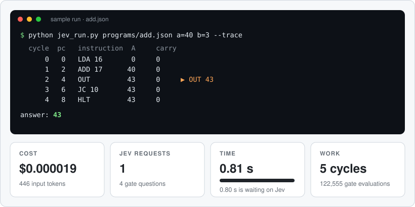
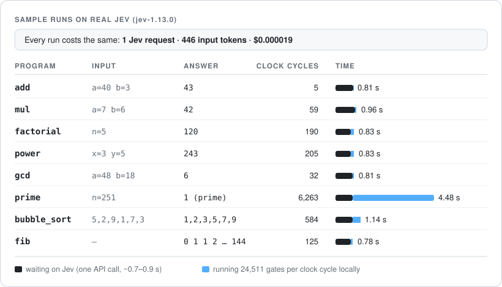

# jev-computer

**คอมพิวเตอร์ 8-bit ที่สร้างจากคำถาม ใช่/ไม่ใช่ ข้อเดียวที่ถาม AI**

[English → README.md](README.md)

Jev ถูกถามแค่เรื่องเดียว: *"`a` กับ `b` เป็น 1 ทั้งคู่ไหม?"* คำตอบ 4 ข้อของมันกลายเป็น NAND gate แล้วเอา gate แบบนี้ 24,511 ตัวมาต่อกันก็ได้คอมพิวเตอร์ที่มี RAM 256 bytes รัน factorial, ตรวจจำนวนเฉพาะ และ bubble sort ได้ ส่วนโปรแกรมเป็นแค่ไฟล์ JSON


## Jev คืออะไร

[Jev](https://docs.typesafe.ai) คือ System One model ของ TypeSafe มันไม่ได้ตอบเป็นข้อความ เราส่ง **state** (ข้อมูลที่ให้มันดู) กับ **คำถาม** แบบมีชนิดไป แล้วมันตอบกลับมาทีละคำถาม:

- **Noul:** คำถาม ใช่/ไม่ใช่ ตอบเป็นความน่าจะเป็นที่คำตอบคือ "ใช่"
- **Choice:** เลือกหนึ่งตัวเลือกจากรายการ
- **Score:** ให้คะแนนตามสเกลที่เรากำหนด

ตัวอย่างการใช้งานทั่วไปจากเอกสารของ TypeSafe คือตัดสินว่าข้อความจากลูกค้าเร่งด่วนไหม (ตัด response ให้สั้นลง):

```json
{
  "model": "jev-latest",
  "state": "Help! My payouts have been failing for 3 days.",
  "questions": {
    "is_urgent": {"type": "noul", "instructions": "Does this convey urgency?"}
  }
}
```

```json
{"answers": {"is_urgent": {"type": "noul", "noul": 0.95}}}
```

จากนั้นโค้ดของเราเป็นคนตัดสินว่า 0.95 หมายถึงอะไร เช่น "ส่งต่อให้ทีมที่เข้าเวรอยู่"

โปรเจกต์นี้ใช้ API ตัวเดียวกัน แต่ถามคำถามที่เล็กที่สุดเท่าที่เป็นไปได้ request เดียวถามครบทั้ง 4 กรณีของ gate นี่คือ request และ response จริง (ตัด response ให้สั้นลง):

```json
{
  "model": "jev-1.13.0",
  "state": {"g00": {"a": 0, "b": 0}, "g01": {"a": 0, "b": 1},
            "g10": {"a": 1, "b": 0}, "g11": {"a": 1, "b": 1}},
  "questions": {
    "g00": {"type": "noul", "instructions": "Are both `g00.a` and `g00.b` equal to 1?"},
    "g01": {"type": "noul", "instructions": "Are both `g01.a` and `g01.b` equal to 1?"},
    "g10": {"type": "noul", "instructions": "Are both `g10.a` and `g10.b` equal to 1?"},
    "g11": {"type": "noul", "instructions": "Are both `g11.a` and `g11.b` equal to 1?"}
  }
}
```

```json
{"answers": {"g00": {"noul": 0.0}, "g01": {"noul": 0.01}, "g10": {"noul": 0.01}, "g11": {"noul": 0.99}},
 "usage": {"input_tokens": 446, "output_tokens": 76}}
```

**Jev ทำงานได้ดีที่สุดเมื่อ** แต่ละคำถามเป็นการตัดสินเรื่องเดียวแคบๆ คำถามหลายข้อที่ใช้ state เดียวกันรวมไว้ใน request เดียว และให้โค้ดเป็นคนประกอบคำตอบ โปรเจกต์นี้คือการใช้แนวคิดนี้แบบสุดทาง

## แนวคิด: เริ่มจาก 0 กับ 1

โปรเจกต์นี้ไม่ได้เริ่มจากการตั้งใจสร้างคอมพิวเตอร์ แต่เริ่มจากคำถามว่า **Jev บวกเลขได้ไหม?**

1. **ถามตรงๆ แล้วคำตอบไม่นิ่ง** ลองให้ Jev บวก `7 + 8` หลักหน่วยตอบถูกด้วยความมั่นใจ 98% แต่คำถามเรื่องตัวทด ("หลักนี้ทด 1 ไหม") ได้แค่ 88% ทั้งที่ผลรวมแค่ 15 และถ้าตัวทดผิดครั้งเดียว ผิดต่อไปทุกหลัก
2. **เลยย่อคำถามให้เล็กจนตีความผิดไม่ได้** คำถามที่เล็กที่สุดในคอมพิวเตอร์คือคำถามเกี่ยวกับ 2 bit: *"`a` กับ `b` เป็น 1 ทั้งคู่ไหม?"* มี input ได้แค่ 4 แบบ จึงทดสอบได้ครบทุกกรณี Jev ตอบ 0.99 สำหรับ (1, 1) และ 0.00–0.01 สำหรับอีก 3 กรณี ได้เหมือนเดิมทุกครั้ง
3. **คำตอบนั้นคือ logic gate** "เป็น 1 ทั้งคู่" คือ AND กลับค่าก็ได้ NAND ซึ่งเป็น *universal gate* คือวงจรดิจิทัลทุกแบบ รวมถึงคอมพิวเตอร์ทั้งเครื่อง สร้างจาก NAND อย่างเดียวได้
4. **จากนั้นประกอบขึ้นไปทีละชั้น:**

| ชั้น | สร้างจาก | ขนาด |
|---|---|---|
| คำถามถึง Jev | คำตอบ ใช่/ไม่ใช่ 4 ข้อ | API 1 request, 446 tokens |
| NAND gate | คำตอบของ Jev | 1 gate |
| Full adder (บวก 3 bit) | NAND gate | 9 gate |
| ตัวบวก 8-bit | full adder | 72 gate |
| CPU: ตัวถอดรหัสคำสั่ง, ALU, flag, program counter | ตัวบวกและ gate | 383 gate |
| ทั้งเครื่อง: CPU + RAM 256 bytes | ทุกอย่างข้างบน | 24,511 gate |
| โปรแกรม: factorial, จำนวนเฉพาะ, bubble sort | คำสั่งใน RAM | ไฟล์ JSON |

การทดลองแรกถาม NAND ตรงๆ ก็ได้คำตอบถูก แต่ตอนนี้เครื่องเปลี่ยนมาถามแบบ AND แล้วกลับค่าแทน เพราะคำถามแบบปฏิเสธ ("Is it false that…") ทำให้ Noul ตอบได้คมน้อยลง:


## เริ่มใช้งาน

ใช้ Python 3.9 ขึ้นไป ไม่ต้องติดตั้ง library เพิ่ม

```bash
cp .env.example .env                                  # ใส่ TypeSafe API key

python jev_run.py --selftest                          # ตรวจคำตอบ gate ของ Jev (5 requests)
python jev_run.py programs/factorial.json n=5         # 120
python jev_run.py programs/prime.json n=97            # 1 (เป็นจำนวนเฉพาะ)
python jev_run.py programs/bubble_sort.json list=5,2,9,1,7,3
```



| ตัวเลือก | ทำอะไร |
|---|---|
| `ชื่อ=ค่า` | ใส่ค่า input ของโปรแกรม (0–255) |
| `ชื่อ=4,7,9` | ใส่ input ที่เป็น list |
| `--trace` | แสดงทุกคำสั่งที่ CPU รัน |
| `--test` | รันชุดทดสอบที่เขียนไว้ในไฟล์ JSON ของโปรแกรม |
| `--selftest` | ถามคำถาม gate กับ Jev 5 รอบ แล้วตรวจทุกคำตอบ |

## โปรแกรม

| ไฟล์ | ทำอะไร | Input | ตัวอย่าง |
|---|---|---|---|
| `add.json` | a + b (ได้ถึง 510) | `a`, `b` | `a=255 b=255` → 510 |
| `sub.json` | a − b (ติดลบได้) | `a`, `b` | `a=15 b=17` → −2 |
| `mul.json` | a × b | `a`, `b` | `a=7 b=6` → 42 |
| `div.json` | a ÷ b (ผลหารจำนวนเต็ม) | `a`, `b` | `a=200 b=7` → 28 |
| `power.json` | x ยกกำลัง y | `x`, `y` | `x=3 y=5` → 243 |
| `pow2.json` | 2 ยกกำลัง y | `y` | `y=7` → 128 |
| `factorial.json` | n! | `n` | `n=5` → 120 |
| `sum_to_n.json` | 1 + 2 + … + n | `n` | `n=10` → 55 |
| `gcd.json` | ห.ร.ม. | `a`, `b` (1–255) | `a=48 b=18` → 6 |
| `prime.json` | n เป็นจำนวนเฉพาะไหม (1 = ใช่, 0 = ไม่ใช่) | `n` | `n=251` → 1 |
| `max_min.json` | ค่ามากสุดและน้อยสุดของตัวเลข 8 ตัว | `list` (8 ตัว) | `list=42,7,19,200,3,88,150,64` → [200, 3] |
| `linear_search.json` | ตำแหน่งของ `x` ในตัวเลข 8 ตัว | `list` (8 ตัว), `x` | `x=42` → 5 |
| `bubble_sort.json` | เรียงตัวเลข 6 ตัว | `list` (6 ตัว) | `list=5,2,9,1,7,3` → [1, 2, 3, 5, 7, 9] |
| `countdown.json` | นับ n, n−1, … 0 | `n` | `n=5` → 5 4 3 2 1 0 |
| `fib.json` | Fibonacci ถึง 144 | — | 0 1 1 2 … 144 |

ทุกไฟล์อยู่ใน `programs/`

**ข้อแนะนำ:**
- **ตัวเลขเป็น 8-bit (0–255)** ถ้าผลของ `mul`, `power`, `pow2`, `factorial` หรือ `sum_to_n` เกิน 255 จะตอบ `overflow (> 255)` ส่วนผลหารได้เฉพาะจำนวนเต็ม
- **ห้ามหารด้วย 0** เพราะ CPU จะวนไม่จบ ตัวรันจะหยุดเองที่ 100,000 รอบ clock แล้วแจ้ง error ส่วน `gcd` ต้องใส่ตัวเลขตั้งแต่ 1 ขึ้นไปด้วยเหตุผลเดียวกัน
- **ใส่ตัวเลขที่เล็กกว่าเป็น `b` ใน `mul`** เพราะ `b` คือจำนวนรอบของ loop เช่น `a=200 b=1` ใช้ 14 รอบ clock แต่ `a=1 b=200` ใช้ 1,805 รอบ

## ผลการรันจริง (`jev-1.13.0`)



- **ทุกการรันจ่ายเท่ากัน:** 1 request, 446 tokens (ราว $0.00002) เพราะ Jev ตอบตาราง gate ครั้งเดียว แล้วทุก gate ใช้คำตอบนั้นร่วมกัน
- **เวลาส่วนใหญ่คือการรอ Jev** (ราว 0.7–0.9 วินาที) การประมวลผล gate ในเครื่องจะมีผลแค่กับโปรแกรมที่รันนานอย่าง `prime n=251`
- **ชุดทดสอบ:** ผ่านครบ 65 เคสของทั้ง 15 โปรแกรม (65 requests, 28,990 tokens) และ selftest ของ gate ผ่าน 20/20

## เขียนโปรแกรมเอง

โปรแกรมหนึ่งตัวคือไฟล์ JSON ไฟล์เดียว ไม่ต้องแก้ไฟล์อื่นเลย

```json
{
  "about": "Double a number: a + a.",
  "inputs": ["a"],
  "code": ["LDA a", "ADD a", "OUT", "HLT"],
  "data": {"a": 21},
  "tests": [
    {"with": {"a": 21}, "expect": [42]},
    {"with": {"a": 100}, "expect": [200]}
  ]
}
```

```bash
python jev_run.py double.json a=21     # answer: [42]
python jev_run.py double.json --test   # 2/2 passed
```

| Key | ความหมาย |
|---|---|
| `code` | คำสั่งเรียงตามลำดับ ขึ้นต้นบรรทัดด้วย `ชื่อ:` เพื่อตั้ง label เช่น `"loop: LDA n"` |
| `data` | ตัวแปรที่มีชื่อ เช่น `{"n": 5}` หรือ list เช่น `{"list": [4, 7, 9]}` จะถูกวางใน RAM ต่อจาก code |
| `inputs` | ชื่อใน `data` ที่ใส่ค่าจาก command line หรือจาก tests ได้ |
| `about` | ข้อความหนึ่งบรรทัดที่พิมพ์ก่อนรัน |
| `result` | *ไม่ใส่ก็ได้* บอกวิธีอ่าน output (ดูด้านล่าง) |
| `tests` | *ไม่ใส่ก็ได้* เคสทดสอบรูปแบบ `{"with": {inputs}, "expect": คำตอบ}` ใช้กับ `--test` |

operand ของคำสั่งเป็นได้ 3 แบบ:
- ตัวเลข เช่น `LDI 5`
- ชื่อ label หรือชื่อ data เช่น `JMP loop`, `LDA n`
- ชื่อบวกหรือลบตัวเลข เช่น `LDA list+2`, `STA get+1`

ถ้าใช้ชื่อกับ `LDI` จะได้ address ของชื่อนั้น เช่น `LDI list` จะใส่ address ของ list ลงใน A CPU ไม่มีคำสั่ง pointer โปรแกรมที่ต้องไล่อ่าน list (เช่น `bubble_sort`) จึงใช้วิธีแก้ operand ของคำสั่ง `LDA`/`STA` ของตัวเองระหว่างรัน

รูปแบบของ `result`:
- ไม่ใส่ `result`: ได้ list ของทุกค่าที่ `OUT` ออกมา
- `{}`: ค่าแรกที่ `OUT` คือคำตอบ
- `"add": n`: บวก n เข้ากับคำตอบ
- `"second_output_adds": 256`: ถ้ามี `OUT` ครั้งที่สอง (เช่น carry) ให้บวก 256
- `"no_output": "ข้อความ"`: คำตอบที่ใช้เมื่อไม่มีการ `OUT` เลย

กติกา:
- code กับ data ใช้ RAM 256 bytes ร่วมกัน (คำสั่งละ 2 bytes)
- ค่าอยู่ในช่วง 0–255
- โปรแกรมต้องไปถึง `HLT`

### ชุดคำสั่ง

เครื่องแบบ accumulator 8-bit มี RAM 256 bytes ทุกคำสั่งยาว 2 bytes คือ `[opcode] [operand]`

| คำสั่ง | ความหมาย |
|---|---|
| `LDA n` | A = RAM[n] |
| `ADD n` | A = A + RAM[n] ถ้าเกิน 255 ได้ carry = 1 |
| `SUB n` | A = A − RAM[n] ได้ carry = 1 ถ้า**ไม่**ต้องยืม |
| `STA n` | RAM[n] = A |
| `LDI n` | A = n (0–255) |
| `JMP n` | กระโดดไป address n |
| `JZ n` | กระโดดถ้า A = 0 |
| `JC n` | กระโดดถ้า carry = 1 |
| `OUT` | ส่ง A ออก output port |
| `HLT` | หยุด |
| `NOP` | ไม่ทำอะไร |

## ทำงานอย่างไร

1. **วงจร:** `build_cpu.py` สร้างทั้งเครื่องจาก NAND อย่างเดียว (ตัวถอดรหัสคำสั่ง, ALU, flag, program counter, การกระโดด และ RAM 256 bytes) แล้วเขียนลง `cpu.json`
2. **ตัวรัน:** `jev_run.py` โหลดโปรแกรมลง RAM ถาม Jev ทั้ง 4 กรณีของ gate ใน request เดียว แล้วประมวลผล gate ทั้ง 24,511 ตัวทุกรอบ clock ด้วยคำตอบของ Jev จนโปรแกรมหยุด


**สร้างจาก Jev จริงไหม?** จริง ในแบบเดียวกับที่คอมพิวเตอร์จริงสร้างจาก transistor: transistor ตัดสินว่า gate ให้ค่าอะไร แต่ยังต้องมีแผงวงจร สายไฟ และ clock ในโปรเจกต์นี้ Jev เป็นตัวตัดสินว่าทุก gate ให้ค่าอะไร ส่วน `cpu.json` คือแผงวงจร และ `jev_run.py` คือสายไฟกับ clock

| Jev: logic ทั้งหมด | โค้ด: ไม่มี logic |
|---|---|
| ตัดสินว่า gate ให้ค่าอะไร (ตาราง NAND) | ถือ bit ของ register และ RAM (flip-flop) |
| การบวก, ตัวทด, ถอดรหัสคำสั่ง, กระโดด และอ่าน/เขียน RAM ทุกครั้งได้มาจากคำตอบนั้น | เดิน clock และส่งค่าไปตามสายใน `cpu.json` |
| ถ้า Jev ตอบผิดแม้แต่กรณีเดียว ทุกโปรแกรมจะคำนวณผิดหมด ไม่มีคำตอบสำรอง | แปลง bit เป็นเลขฐานสิบเพื่อแสดงผล |

Jev ตอบ 4 กรณีครั้งเดียวต่อการรัน แล้วคำตอบนั้นขับทุก gate ในทุกรอบ clock Jev เป็นผู้กำหนดว่า gate ทำงานอย่างไร แต่ไม่ได้กดสวิตช์ทุกครั้งเอง

## ไฟล์

| ไฟล์ | คืออะไร | ใช้เมื่อไหร่ |
|---|---|---|
| `jev_run.py` | ตัวรัน: โหลดโปรแกรม ถาม Jev ครั้งเดียว แล้วเดิน clock | ทุกครั้งที่รันโปรแกรม |
| `programs/*.json` | โปรแกรมทั้ง 15 ตัว | เพิ่มไฟล์ที่นี่เพื่อเพิ่มโปรแกรม |
| `cpu.json` | ตัวเครื่อง: NAND 24,511 ตัว + ชุดคำสั่ง (สร้างอัตโนมัติ) | `jev_run.py` อ่านไฟล์นี้เอง |
| `build_cpu.py` | สร้าง `cpu.json` ส่วน `--check` ใช้ตรวจวงจรโดยไม่เรียก API | เฉพาะตอนแก้การออกแบบตัวเครื่อง |

## นี่คืออะไร (และไม่ใช่อะไร)

นี่ไม่ใช่คอมพิวเตอร์ที่ใช้งานจริง มันช้ากว่า CPU จริงราวหมื่นล้านเท่า และไม่ควรมีใครคิดเลขผ่าน language model นี่คือตัวอย่างวิธีใช้ model อย่าง Jev ให้ได้ผลดี: **อย่าถามคำถามใหญ่ที่ต้องคิดหลายขั้น ให้แตกงานเป็นคำตัดสินเล็กที่สุดที่มันตอบได้ชัด แล้วให้โค้ดเป็นคนประกอบ**

## License

MIT
