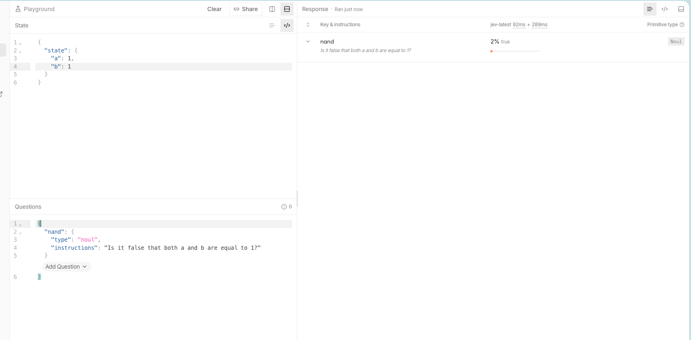
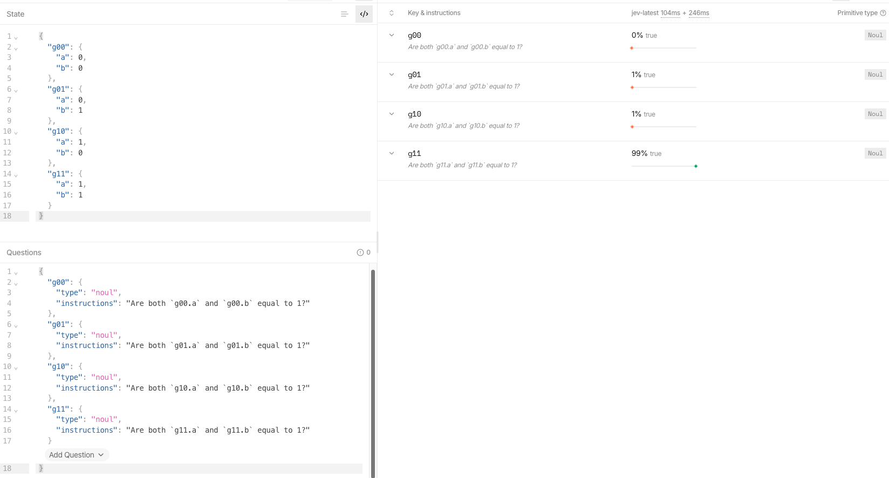
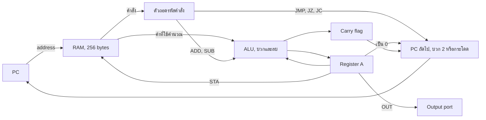
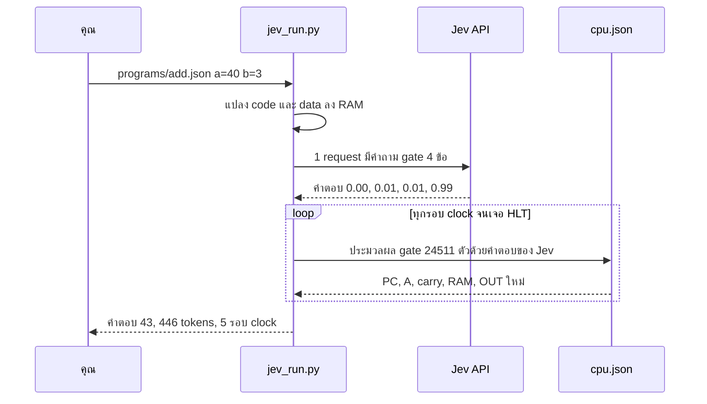

# jev-computer

**คอมพิวเตอร์ 8-bit ที่สร้างจากคำถาม ใช่/ไม่ใช่ ข้อเดียวที่ถาม AI**

[English → README.md](README.md)

[Jev](https://docs.typesafe.ai) (System One model ของ TypeSafe) คิดเลขไม่เป็น ไม่รู้จัก CPU และไม่ได้เขียนโค้ด มันถูกถามผ่าน API แค่เรื่องเดียว:

> *"`a` กับ `b` เป็น 1 ทั้งคู่ไหม?"*

คำตอบของ Jev ต่อ input ทั้ง 4 แบบกลายเป็น AND gate แล้วกลับค่าเป็น NAND ซึ่งเป็น universal gate คือสร้างวงจรดิจิทัลอะไรก็ได้จาก NAND อย่างเดียว เอา NAND 24,511 ตัวมาต่อกันก็ได้คอมพิวเตอร์ที่มี RAM 256 bytes รัน factorial, ตรวจจำนวนเฉพาะ และ bubble sort ได้ ส่วนโปรแกรมเป็นแค่ไฟล์ JSON


## แนวคิด: เริ่มจาก 0 กับ 1

โปรเจกต์นี้ไม่ได้เริ่มจากการตั้งใจสร้างคอมพิวเตอร์ แต่เริ่มจากคำถามว่า **Jev บวกเลขได้ไหม?**

1. **ถามตรงๆ แล้วคำตอบไม่นิ่ง** ลองให้ Jev บวก `7 + 8` หลักหน่วยตอบถูกด้วยความมั่นใจ 98% แต่คำถามเรื่องตัวทด ("หลักนี้ทด 1 ไหม") ได้แค่ 88% ทั้งที่ผลรวมแค่ 15 และถ้าตัวทดผิดครั้งเดียว ผิดต่อไปทุกหลัก คำถามที่ต้องคิดหลายขั้นคือจุดที่ Jev เริ่มไม่มั่นใจ
2. **เลยย่อคำถามให้เล็กจนตีความผิดไม่ได้** คำถามที่เล็กที่สุดในคอมพิวเตอร์คือคำถามเกี่ยวกับ 2 bit: *"`a` กับ `b` เป็น 1 ทั้งคู่ไหม?"* มี input ได้แค่ 4 แบบ จึงทดสอบได้ครบทุกกรณี Jev ตอบ 0.99 สำหรับ (1, 1) และ 0.00–0.01 สำหรับอีก 3 กรณี ได้เหมือนเดิมทุกครั้ง
3. **คำตอบนั้นคือ logic gate** "เป็น 1 ทั้งคู่" คือ AND กลับค่าก็ได้ NAND ซึ่งเป็น *universal gate* คือวงจรดิจิทัลทุกแบบ รวมถึงคอมพิวเตอร์ทั้งเครื่อง สร้างจาก NAND อย่างเดียวได้
4. **จากนั้นประกอบขึ้นไปทีละชั้น** แต่ละชั้นใช้แค่ชั้นที่อยู่ใต้มัน:

| ชั้น | สร้างจาก | ขนาด |
|---|---|---|
| คำถามถึง Jev | คำตอบ ใช่/ไม่ใช่ 4 ข้อ | API 1 request, 446 tokens |
| NAND gate | คำตอบของ Jev | 1 gate |
| Full adder (บวก 3 bit) | NAND gate | 9 gate |
| ตัวบวก 8-bit | full adder | 72 gate |
| CPU: ตัวถอดรหัสคำสั่ง, ALU, flag, program counter | ตัวบวกและ gate | 383 gate |
| ทั้งเครื่อง: CPU + RAM 256 bytes | ทุกอย่างข้างบน | 24,511 gate |
| โปรแกรม: factorial, จำนวนเฉพาะ, bubble sort | คำสั่งใน RAM | ไฟล์ JSON |

บทเรียนนี้ใช้กับแอปจริงที่ใช้ Jev ได้ด้วย: **อย่าถาม model คำถามใหญ่ที่ต้องคิดหลายขั้น ให้แตกเป็นคำตัดสินเล็กๆ ที่มันตอบได้ชัด แล้วให้โค้ดเป็นคนประกอบ**

### ใน Jev Playground

**การทดลองแรก:** ถาม NAND ตรงๆ ด้วย a = 1, b = 1 Jev ตอบ 2% "true" ซึ่งถูกต้อง (NAND ของ 1 กับ 1 คือ 0)



**ที่เครื่องใช้จริงตอนนี้:** ถามแบบ AND ครบทั้ง 4 กรณีใน request เดียว แล้วกลับค่าเป็น NAND Jev ตอบ 0%, 1%, 1% และ 99% ที่เปลี่ยนมาถามแบบ AND เพราะคำถามแบบปฏิเสธ ("Is it false that…") ทำให้ Noul ตอบได้คมน้อยลง และการถามครบ 4 กรณีใน request เดียวทั้งถูกกว่าและทดสอบได้ครบทุกกรณี



### สร้างจาก Jev จริงไหม?

จริง ในแบบเดียวกับที่คอมพิวเตอร์จริงสร้างจาก transistor transistor เป็นตัวตัดสินว่า gate ให้ค่าอะไร แต่ก็ยังต้องมีแผงวงจร สายไฟ และ clock ในโปรเจกต์นี้ **Jev เป็นตัวตัดสินว่าทุก gate ให้ค่าอะไร** ส่วน `cpu.json` คือแผงวงจร และ `jev_run.py` คือสายไฟกับ clock เหมือนคอมพิวเตอร์ที่สร้างจาก redstone ใน Minecraft ที่รันบน game engine ซึ่งเขียนด้วย Java แต่ทุกคนก็เรียกว่าคอมจาก redstone

พูดให้ตรงคือ Jev ตอบ 4 กรณีของ gate **ครั้งเดียวต่อการรัน** แล้วคำตอบนั้นขับ gate ทั้ง 24,511 ตัวในทุกรอบ clock Jev เป็นผู้กำหนดว่า gate ทำงานอย่างไร แต่ไม่ได้กดสวิตช์ทุกครั้งเอง และไม่มีคำตอบสำรอง ถ้า Jev ตอบผิดแม้แต่ข้อเดียว ทุกโปรแกรมจะคำนวณผิดหมด Python ไม่ได้คำนวณเลขแทนเลย

## เริ่มใช้งาน

ใช้ Python 3.9 ขึ้นไป ไม่ต้องติดตั้ง library เพิ่ม

```bash
cp .env.example .env                                  # ใส่ TypeSafe API key

python jev_run.py --selftest                          # ตรวจคำตอบ gate ของ Jev (5 requests)
python jev_run.py programs/factorial.json n=5         # 120
python jev_run.py programs/prime.json n=97            # 1 (เป็นจำนวนเฉพาะ)
python jev_run.py programs/bubble_sort.json list=5,2,9,1,7,3
```

```
$ python jev_run.py programs/mul.json a=7 b=6
a x b by repeated addition (b is the loop count). Answers overflow above 255.
output port: [42]
answer: 42
jev: 1 request · 446 input tokens ($0.000019) · 0.9 s · 59 clock cycles · 1,446,149 gate evaluations
```

| ตัวเลือก | ทำอะไร |
|---|---|
| `ชื่อ=ค่า` | ใส่ค่า input ของโปรแกรม (0–255) |
| `ชื่อ=4,7,9` | ใส่ input ที่เป็น list |
| `--trace` | แสดงทุกคำสั่งที่ CPU รัน |
| `--test` | รันชุดทดสอบที่เขียนไว้ในไฟล์ JSON ของโปรแกรม |
| `--selftest` | ถามคำถาม gate กับ Jev 5 รอบ แล้วตรวจทุกคำตอบ |

## โปรแกรม

| ไฟล์ | ทำอะไร | Input | ตัวอย่าง |
|---|---|---|---|
| `add.json` | a + b (ได้ถึง 510) | `a`, `b` | `a=255 b=255` → 510 |
| `sub.json` | a − b (ติดลบได้) | `a`, `b` | `a=15 b=17` → −2 |
| `mul.json` | a × b | `a`, `b` | `a=7 b=6` → 42 |
| `div.json` | a ÷ b (ผลหารจำนวนเต็ม) | `a`, `b` | `a=200 b=7` → 28 |
| `power.json` | x ยกกำลัง y (loop ซ้อน loop) | `x`, `y` | `x=3 y=5` → 243 |
| `pow2.json` | 2 ยกกำลัง y | `y` | `y=7` → 128 |
| `factorial.json` | n! (loop ซ้อน loop) | `n` | `n=5` → 120 |
| `sum_to_n.json` | 1 + 2 + … + n | `n` | `n=10` → 55 |
| `gcd.json` | ห.ร.ม. (Euclid) | `a`, `b` (1–255) | `a=48 b=18` → 6 |
| `prime.json` | n เป็นจำนวนเฉพาะไหม (1 = ใช่, 0 = ไม่ใช่) | `n` | `n=251` → 1 |
| `max_min.json` | ค่ามากสุดและน้อยสุดของตัวเลข 8 ตัว | `list` (8 ตัว) | `list=42,7,19,200,3,88,150,64` → [200, 3] |
| `linear_search.json` | ตำแหน่งของ `x` ในตัวเลข 8 ตัว | `list` (8 ตัว), `x` | `x=42` → 5 |
| `bubble_sort.json` | เรียงตัวเลข 6 ตัว | `list` (6 ตัว) | `list=5,2,9,1,7,3` → [1, 2, 3, 5, 7, 9] |
| `countdown.json` | นับ n, n−1, … 0 | `n` | `n=5` → 5 4 3 2 1 0 |
| `fib.json` | Fibonacci ถึง 144 | — | 0 1 1 2 … 144 |

ทุกไฟล์อยู่ใน `programs/` ทุกโปรแกรมผ่านชุดทดสอบกับ Jev จริง 65 จาก 65 เคส ใช้ 65 requests และ 28,990 input tokens

`max_min`, `linear_search` และ `bubble_sort` ไล่อ่าน list ด้วยการแก้คำสั่ง `LDA`/`STA` ของตัวเองระหว่างรัน (self-modifying code) เพราะ CPU ไม่มีคำสั่ง pointer

### ใช้โปรแกรมให้ได้ผลดี

- **ตัวเลขเป็น 8-bit (0–255)**
  - ผลบวกได้ถึง 510 เพราะ carry ออกมาเป็น bit ที่ 9
  - ผลลบติดลบได้
  - ถ้าผลของ `mul`, `power`, `pow2`, `factorial` หรือ `sum_to_n` เกิน 255 จะตอบ `overflow (> 255)`
  - ผลหารได้เฉพาะจำนวนเต็ม
- **ห้ามหารด้วย 0** เพราะ CPU จะวนไม่จบ ตัวรันจะหยุดเองที่ 100,000 รอบ clock แล้วแจ้ง error ส่วน `gcd` ต้องใส่ตัวเลขตั้งแต่ 1 ขึ้นไปด้วยเหตุผลเดียวกัน
- **ใส่ตัวเลขที่เล็กกว่าเป็น `b` ใน `mul`** เพราะ `b` คือจำนวนรอบของ loop เช่น `a=200 b=1` ใช้ 14 รอบ clock แต่ `a=1 b=200` ใช้ 1,805 รอบ ส่วนการหารใช้ราว 8 รอบต่อผลหาร 1 หน่วย (`255 ÷ 1` ใช้ 2,046 รอบ)
- **ทุกการรันจ่ายเท่ากัน** คือ 1 request, 446 tokens (ราว $0.00002) ไม่ว่าโปรแกรมจะรันนานแค่ไหน เพราะ Jev ตอบตาราง gate ครั้งเดียว แล้วทุก gate ใช้คำตอบนั้นร่วมกัน เคสที่นานที่สุดคือ `prime n=251` ใช้ 6,263 รอบ clock (ประมวลผล gate 153 ล้านครั้ง) ในราว 5 วินาที
- **ใช้ `--trace` ดูว่าคำตอบคำนวณออกมาอย่างไร** จะแสดงทุกคำสั่งที่ CPU รัน และค่า A ในแต่ละขั้น

## เขียนโปรแกรมเอง

โปรแกรมหนึ่งตัวคือไฟล์ JSON ไฟล์เดียว ไม่ต้องแก้ไฟล์อื่นเลย

```json
{
  "about": "Double a number: a + a.",
  "inputs": ["a"],
  "code": ["LDA a", "ADD a", "OUT", "HLT"],
  "data": {"a": 21},
  "tests": [
    {"with": {"a": 21}, "expect": [42]},
    {"with": {"a": 100}, "expect": [200]}
  ]
}
```

```bash
python jev_run.py double.json a=21     # answer: [42]
python jev_run.py double.json --test   # 2/2 passed
```

| Key | ความหมาย |
|---|---|
| `code` | คำสั่งเรียงตามลำดับ ขึ้นต้นบรรทัดด้วย `ชื่อ:` เพื่อตั้ง label เช่น `"loop: LDA n"` |
| `data` | ตัวแปรที่มีชื่อ เช่น `{"n": 5}` หรือ list เช่น `{"list": [4, 7, 9]}` จะถูกวางใน RAM ต่อจาก code |
| `inputs` | ชื่อใน `data` ที่ใส่ค่าจาก command line หรือจาก tests ได้ |
| `about` | ข้อความหนึ่งบรรทัดที่พิมพ์ก่อนรัน |
| `result` | *ไม่ใส่ก็ได้* บอกวิธีอ่าน output (ดูด้านล่าง) |
| `tests` | *ไม่ใส่ก็ได้* เคสทดสอบรูปแบบ `{"with": {inputs}, "expect": คำตอบ}` ใช้กับ `--test` |

operand ของคำสั่งเป็นได้ 3 แบบ:
- ตัวเลข เช่น `LDI 5`
- ชื่อ label หรือชื่อ data เช่น `JMP loop`, `LDA n`
- ชื่อบวกหรือลบตัวเลข เช่น `LDA list+2`, `STA get+1`

ถ้าใช้ชื่อกับ `LDI` จะได้ address ของชื่อนั้น เช่น `LDI list` จะใส่ address ของ list ลงใน A

รูปแบบของ `result`:
- ไม่ใส่ `result`: ได้ list ของทุกค่าที่ `OUT` ออกมา
- `{}`: ค่าแรกที่ `OUT` คือคำตอบ
- `"add": n`: บวก n เข้ากับคำตอบ
- `"second_output_adds": 256`: ถ้ามี `OUT` ครั้งที่สอง (เช่น carry) ให้บวก 256
- `"no_output": "ข้อความ"`: คำตอบที่ใช้เมื่อไม่มีการ `OUT` เลย

กติกา:
- code กับ data ใช้ RAM 256 bytes ร่วมกัน (คำสั่งละ 2 bytes)
- ค่าอยู่ในช่วง 0–255
- โปรแกรมต้องไปถึง `HLT`

### ชุดคำสั่ง

เครื่องแบบ accumulator 8-bit มี RAM 256 bytes ทุกคำสั่งยาว 2 bytes คือ `[opcode] [operand]` และ PC เดินหน้าทีละ 2

| คำสั่ง | ความหมาย |
|---|---|
| `LDA n` | A = RAM[n] |
| `ADD n` | A = A + RAM[n] ถ้าเกิน 255 ได้ carry = 1 |
| `SUB n` | A = A − RAM[n] ได้ carry = 1 ถ้า**ไม่**ต้องยืม |
| `STA n` | RAM[n] = A |
| `LDI n` | A = n (0–255) |
| `JMP n` | กระโดดไป address n |
| `JZ n` | กระโดดถ้า A = 0 |
| `JC n` | กระโดดถ้า carry = 1 |
| `OUT` | ส่ง A ออก output port |
| `HLT` | หยุด |
| `NOP` | ไม่ทำอะไร |

## ผลการรันจริง (`jev-1.13.0`)

| การทดลอง | ผล | Requests | Input tokens | เวลา |
|---|---|---:|---:|---:|
| Gate selftest ถามซ้ำ 5 รอบ × 4 กรณี | ถูก 20/20, p = 0.00–0.01 / 0.99 | 5 | 2,230 | — |
| ชุดทดสอบทุกโปรแกรม (15 โปรแกรม) | ผ่าน 65/65 | 65 | 28,990 | ~63 วินาที |

## ทำงานอย่างไร

1. **Gate:** request เดียวมีคำถาม Noul 4 ข้อ ข้อละหนึ่งกรณีของ input Jev ตอบความน่าจะเป็นที่คำตอบคือ "ใช่" ถ้า `p ≥ 0.5` ถือว่า AND = 1 แล้วกลับค่าเป็น NAND
2. **วงจร:** `build_cpu.py` สร้างทั้งเครื่องจาก NAND อย่างเดียว ได้แก่
   - ตัวถอดรหัสคำสั่ง
   - ALU 8-bit พร้อม flag carry และ zero
   - program counter และการกระโดด
   - RAM 256 bytes ที่มีช่องอ่าน 3 ช่อง (คำสั่ง, operand, ข้อมูล) และช่องเขียน 1 ช่อง

   จากนั้นเขียน netlist พร้อมชุดคำสั่งลงใน `cpu.json`
3. **ตัวรัน:** `jev_run.py` แปลงโปรแกรม JSON ลง RAM แล้วถาม Jev ทั้ง 4 กรณีของ gate ใน request เดียว จากนั้นประมวลผล gate ทั้ง 24,511 ตัวทุกรอบ clock ด้วยคำตอบของ Jev และเก็บ state ใหม่

### ภายใน CPU

ทุกกล่องข้างล่างสร้างจาก NAND gate อย่างเดียว และทุก NAND gate ได้ค่ามาจากคำตอบของ Jev



### ลำดับการทำงานของการรันหนึ่งครั้ง



| Jev: logic ทั้งหมด | โค้ด: ไม่มี logic |
|---|---|
| ตัดสินว่า gate ให้ค่าอะไร (ตาราง NAND) | ถือ bit ของ register และ RAM (flip-flop) |
| การบวก ลบ carry ถอดรหัสคำสั่ง กระโดด และอ่าน/เขียน RAM ทุกครั้ง ได้มาจากคำตอบนั้นผ่าน gate 24,511 ตัว | เดิน clock และส่งค่าไปตามสายใน `cpu.json` |
| ถ้า Jev ตอบผิด เครื่องจะคำนวณผิด ไม่มีคำตอบสำรอง | แปลง bit เป็นเลขฐานสิบ และอ่านกฎ `result` |

## ไฟล์

| ไฟล์ | คืออะไร | ใช้เมื่อไหร่ |
|---|---|---|
| `jev_run.py` | ตัวรัน: แปลงโปรแกรม JSON ลง RAM ถาม Jev ครั้งเดียว แล้วเดิน clock | ทุกครั้งที่รันโปรแกรม |
| `programs/*.json` | โปรแกรมทั้ง 15 ตัว | เพิ่มไฟล์ที่นี่เพื่อเพิ่มโปรแกรม |
| `cpu.json` | ตัวเครื่อง: NAND 24,511 ตัว + ชุดคำสั่ง (สร้างอัตโนมัติ) | `jev_run.py` อ่านไฟล์นี้เอง |
| `build_cpu.py` | สร้าง `cpu.json` จาก NAND ส่วน `--check` ใช้ตรวจวงจรโดยไม่เรียก API | เฉพาะตอนแก้การออกแบบตัวเครื่อง |

## นี่คืออะไร (และไม่ใช่อะไร)

นี่ไม่ใช่คอมพิวเตอร์ที่ใช้งานจริง มันช้ากว่า CPU จริงราวหมื่นล้านเท่า และไม่ควรมีใครคิดเลขผ่าน language model สิ่งที่มันแสดงให้เห็นคือ:

- **คำถามแคบๆ ที่ตอบได้ในก้าวเดียว แม่นมาก:** คำถาม gate ได้ 0.99 / 0.01 ทุกครั้ง
- **รวมคำถามที่ใช้ state เดียวกันไว้ใน request เดียว ประหยัดได้ราว 66%:** เหลือ 446 tokens จาก 1,304 ถ้ายิงแยก 4 requests
- **ให้โค้ดคุม state และ flow แล้วให้ model ตัดสินใจ:** เป็นโครงสร้างที่ถูกต้องสำหรับแอปจริงที่ใช้ Jev ด้วย

## License

MIT
